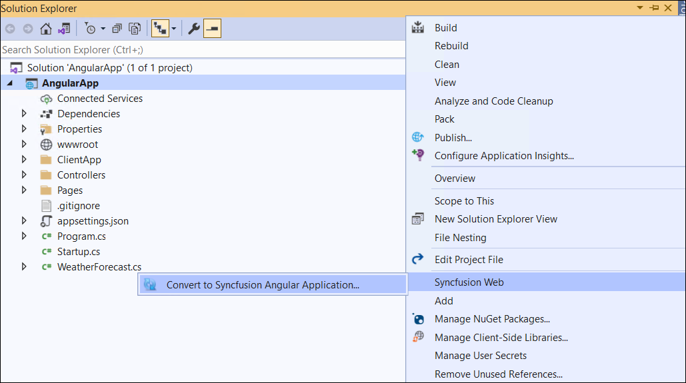
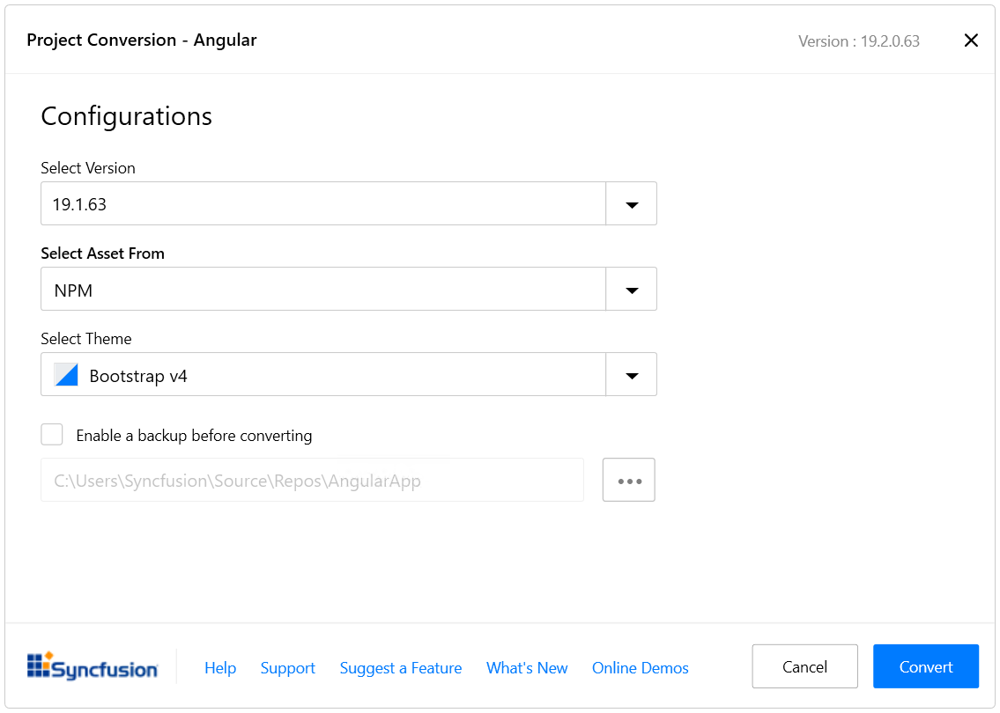

# Convert Project

Syncfusion Angular conversion is a Visual Studio add-in that converts an existing Angular application into a Syncfusion Angular application.

> The Syncfusion Angular Project conversion are available from v17.3.0.9.

The following steps help you to convert the  Angular application to Syncfusion Angular application through the Visual Studio:

1. Open the existing Angular application.

2. To open Syncfusion Project Conversion Wizard, follow either one of the options below:

    **Option 1:**

    Choose **Extensions-> Syncfusion-> Essential Studio for ASP.NET Core ->Convert Project…** in **Visual Studio 2019** menu.

    

    **Option 2:**

    Right-click on the **Angular Application** from the Solution Explorer and select the **Syncfusion Essential JS 2 and choose the Convert to Syncfusion Angular application...**

    

3. The **Syncfusion Project Conversion** window appears. You can choose the required **Syncfusion Angular version** to convert. The Syncfusion Angular versions are loaded from published Syncfusion Angular NPM package versions and it requires the internet connectivity. If you want to take backup of project, select the Backup the project. Also you can choose themes and assets option.

    

4. Once the conversion process completed, will get the success message window.

    

## Convert changes

The Syncfusion NPM packages and selected Style link will be updated with the selected Syncfusion Angular version in the Angular application.

## Npm packages

The installed Syncfusion Angular NPM packages are updated with the selected Syncfusion Angular version in ClientApp/package.json file.

## CDN Style Link

The selected Syncfusion Angular version updated in the ClientApp/src/index.html file with cdn link.

## NPM Style Link

The selected Syncfusion Angular version updated in the ClientApp/src/index.html file from npm package.

