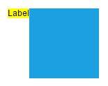
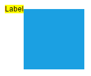
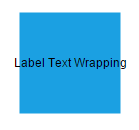
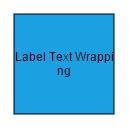

# Annotation

[`Annotation`](../api/diagram/annotationModel) is a block of text that can be displayed over a node or connector. Annotation is used to textually represent an object with a string that can be edited at runtime. Multiple annotations can be added to a node/connector.

<!-- markdownlint-disable MD033 -->

## Create annotation

An annotation can be added to a node/connector by defining the annotation object and adding that to the annotation collection of the node/connector. The [`content`](../api/diagram/annotationModel#content-string) property of annotation defines the text to be displayed. The following code illustrates how to create a annotation.



```typescript
import { Component, ViewEncapsulation, OnInit, ViewChild } from '@angular/core';
import { DiagramComponent, Diagram, NodeModel, ConnectorModel } from '@syncfusion/ej2-angular-diagrams';

@Component({
    selector: "app-container",
    template: `<ejs-diagram #diagram id="diagram" width="100%" height="580px" [getNodeDefaults] ='getNodeDefaults' [getConnectorDefaults] ='getConnectorDefaults'>
        <e-nodes>
            <e-node id='node1' [offsetX]=150 [offsetY]=150>
                <e-node-annotations>
                    <e-node-annotation content="Annotation">
                    </e-node-annotation>
                </e-node-annotations>
            </e-node>
        </e-nodes>
        <e-connectors>
            <e-connector id='connector' type='Orthogonal' [sourcePoint]='sourcePoint1' [targetPoint]='targetPoint1'>
                <e-connector-annotations>
                    <e-connector-annotation content='Annotation'>
                    </e-connector-annotation>
                </e-connector-annotations>
            </e-connector>
        </e-connectors>
    </ejs-diagram>`,
    encapsulation: ViewEncapsulation.None
})
export class AppComponent {
    @ViewChild("diagram")
    public diagram: DiagramComponent;
    public sourcePoint1: PointModel;
    public targetPoint1: PointModel;
    ngOnInit(): void {
        this.sourcePoint1 = { x: 300, y: 100 };
        this.targetPoint1 = { x: 400, y: 300 };
    }
    public getNodeDefaults(node: NodeModel): NodeModel {
        node.height = 100;
        node.width = 100;
        node.style.fill = "#6BA5D7";
        node.style.strokeColor = "White";
        return node;
    }
    public getConnectorDefaults(obj: ConnectorModel): ConnectorModel {
        obj.style = {
            strokeColor: '#6BA5D7',
            fill: '#6BA5D7',
            strokeWidth: 2
        }
        obj.targetDecorator = {
            style: {
                fill: '#6BA5D7',
                strokeColor: '#6BA5D7'
            }
        }
    }
}
```



## Add annotations at runtime

* Annotations can be added at runtime by using the client-side method [`addLabels`](../api/diagram/#addLabels). The following code illustrates how to add a annotation to a node.

* The annotation's [`ID`](../api/diagram/annotationModel#id-string) property is used to define the name of the annotation and its further used to find the annotation at runtime and do any customization.



```typescript
import { Component, ViewEncapsulation, ViewChild } from '@angular/core';
import { DiagramComponent, Diagram, NodeModel, ShapeAnnotationModel } from '@syncfusion/ej2-angular-diagrams';

@Component({
    selector: "app-container",
    template: `<ejs-diagram #diagram id="diagram" width="100%" height="580px" [getNodeDefaults] ='getNodeDefaults' (created)='created($event)'>
        <e-nodes>
            <e-node id='node1' [offsetX]=150 [offsetY]=150>
            </e-node>
        </e-nodes>
    </ejs-diagram>`,
    encapsulation: ViewEncapsulation.None
})
export class AppComponent {
    @ViewChild("diagram")
    public diagram: DiagramComponent;
    public annotation: ShapeAnnotationModel[]
    public getNodeDefaults(node: NodeModel): NodeModel {
        node.height = 100;
        node.width = 100;
        node.style.fill = "#6BA5D7";
        node.style.strokeColor = "White";
        return node;
    }
    public created(args: Object): void {
        this.annotation = [{
            id: 'label1',
            content: 'Annotation'
        }];
        //Method to add labels at run time
        this.diagram.addLabels(this.diagram.nodes[0], this.annotation);
        this.diagram.dataBind();
    }
}
```



## Remove annotation

A collection of annotations can be removed from the node by using client-side method [`removeLabels`](../api/diagram/#removeLabels). The following code illustrates how to remove a annotation to a node.



```typescript
import { Component, ViewEncapsulation, ViewChild } from '@angular/core';
import { DiagramComponent, Diagram, NodeModel,shapeAnnotationModel } from '@syncfusion/ej2-angular-diagrams';

@Component({
    selector: "app-container",
    template: `<ejs-diagram #diagram id="diagram" width="100%" height="580px" [getNodeDefaults] ='getNodeDefaults' (created)='created($event)'>
        <e-nodes>
            <e-node id='node1' [offsetX]=150 [offsetY]=150>
                <e-node-annotations>
                    <e-node-annotation id="label1" content="Annotation">
                    </e-node-annotation>
                </e-node-annotations>
            </e-node>
        </e-nodes>
    </ejs-diagram>`,
    encapsulation: ViewEncapsulation.None
})
export class AppComponent {
    @ViewChild("diagram")
    public diagram: DiagramComponent;
    public getNodeDefaults(node: NodeModel): NodeModel {
        node.height = 100;
        node.width = 100;
        node.style.fill = "#6BA5D7";
        node.style.strokeColor = "White";
        return node;
    }
    public annotation: shapeAnnotationModel[] = [
    {
       id: 'label1', content: 'Annotation'
    }
];
    public created(args: Object): void {
        this.diagram.removeLabels(this.diagram.nodes[0], this.annotation);
    }
}
```



## Update annotation at runtime

You can change any annotation properties at runtime and update it through the client-side method [`dataBind`](../api/diagram/#dataBind).

The following code example illustrates how to change the annotation properties.



```typescript
import { Component, ViewEncapsulation, ViewChild } from '@angular/core';
import { DiagramComponent, Diagram, NodeModel } from '@syncfusion/ej2-angular-diagrams';

@Component({
    selector: "app-container",
    template: `<ejs-diagram #diagram id="diagram" width="100%" height="580px" [getNodeDefaults] ='getNodeDefaults' (created)='created($event)'>
        <e-nodes>
            <e-node id='node1' [offsetX]=150 [offsetY]=150>
                <e-node-annotations>
                    <e-node-annotation id="label1" content="Annotation">
                    </e-node-annotation>
                </e-node-annotations>
            </e-node>
        </e-nodes>
    </ejs-diagram>`,
    encapsulation: ViewEncapsulation.None
})
export class AppComponent {
    @ViewChild("diagram")
    public diagram: DiagramComponent;
    public getNodeDefaults(node: NodeModel): NodeModel {
        node.height = 100;
        node.width = 100;
        node.style.fill = "#6BA5D7";
        node.style.strokeColor = "White";
        return node;
    }
    public created(args: Object): void {
        this.diagram.nodes[0].annotations[0].content = 'Updated Annotation';
        this.diagram.dataBind();
    }
}
```



## Alignment

Annotation can be aligned relative to the node boundaries. It has [`margin`](../api/diagram/annotationModel#margin-marginmodel), [`offset`](../api/diagram/textStyleModel), horizontal, and vertical alignment settings. It is quite tricky when all four alignments are used together but gives more control over alignment.

## Offset

The offset property of annotation is used to align the annotations based on fractions. 0 represents top/left corner, 1 represents bottom/right corner, and 0.5 represents half of width/height.

Set the size for a nodes annotation by using [`width`](../api/diagram/annotationModel#width-number) and
[`height`](../api/diagram/annotationModel#height-number) properties.

The following code shows the relationship between the annotation position (black color circle) and offset (fraction values).



```typescript
import { Component, ViewEncapsulation, OnInit, ViewChild } from '@angular/core';
import { DiagramComponent, Diagram, NodeModel, PointModel } from '@syncfusion/ej2-angular-diagrams';

@Component({
    selector: "app-container",
    template: `<ejs-diagram #diagram id="diagram" width="100%" height="580px" [getNodeDefaults] ='getNodeDefaults'>
        <e-nodes>
            <e-node id='node1' [offsetX]=150 [offsetY]=150>
                <e-node-annotations>
                    <e-node-annotation id="label1" content="Annotation" [offset]="offset">
                    </e-node-annotation>
                </e-node-annotations>
            </e-node>
        </e-nodes>
    </ejs-diagram>`,
    encapsulation: ViewEncapsulation.None
})
export class AppComponent {
    @ViewChild("diagram")
    public diagram: DiagramComponent;
    public offset: PointModel;
    ngOnInit(): void {
        //Sets the offset for the content
        this.offset = { x: 0, y: 1}
    }
    public getNodeDefaults(node: NodeModel): NodeModel {
        node.height = 100;
        node.width = 100;
        node.style.fill = "#6BA5D7";
        node.style.strokeColor = "White";
        return node;
    }
}
```



## Horizontal and vertical alignment

The [`horizontalAlignment`](../api/diagram/annotationModel#horizontalAlignment-string) property of annotation is used to set how the annotation is horizontally aligned at the annotation position determined from the fraction values. The [`verticalAlignment`](../api/diagram/annotationModel#horizontalAlignment-string) property is used to set how annotation is vertically aligned at the annotation position.

The following tables illustrates all the possible alignments visually with 'offset (0, 0)'.

| Horizontal Alignment | Vertical Alignment | Output with Offset(0,0) |
| -------- | -------- | -------- |
| Left | Top |  |
| Center | Top |  |
| Right | Top |   |
| Left | Center |  |
| Center | Center|  |
| Right | Center |  |
| Left | Bottom |  |
| Center | Bottom |  |
| Right |Bottom | |

The following codes illustrates how to align annotations.



```typescript
import { Component, ViewEncapsulation, OnInit, ViewChild } from '@angular/core';
import { DiagramComponent, Diagram, NodeModel, VerticalAlignment, HorizontalAlignment } from '@syncfusion/ej2-angular-diagrams';

@Component({
    selector: "app-container",
    template: `<ejs-diagram #diagram id="diagram" width="100%" height="580px" [getNodeDefaults] ='getNodeDefaults'>
        <e-nodes>
            <e-node id='node1' [offsetX]=150 [offsetY]=150>
                <e-node-annotations>
                    <e-node-annotation id="label1" content="Annotation" [horizontalAlignment]="horizontalAlignment" [verticalAlignment]="verticalAlignment">
                    </e-node-annotation>
                </e-node-annotations>
            </e-node>
        </e-nodes>
    </ejs-diagram>`,
    encapsulation: ViewEncapsulation.None
})
export class AppComponent {
    @ViewChild("diagram")
    public diagram: DiagramComponent;
    public verticalAlignment: VerticalAlignment;
    public horizontalAlignment: HorizontalAlignment;
    ngOnInit(): void {
        // Sets the horizontal alignment as left
        this.horizontalAlignment: 'Left',
        // Sets the vertical alignment as Center
        this.verticalAlignment: 'Center'
    }
    public getNodeDefaults(node: NodeModel): NodeModel {
        node.height = 100;
        node.width = 100;
        node.style.fill = "#6BA5D7";
        node.style.strokeColor = "White";
        return node;
    }
}
```



## Annotation alignment with respect to segments

The offset and alignment properties of annotation allows you to align the connector annotations with respect to the segments.

The following code example illustrates how to align connector annotations.



```typescript
import { Component, ViewEncapsulation, ViewChild } from '@angular/core';
import { DiagramComponent, Diagram, NodeModel, ConnectorModel } from '@syncfusion/ej2-angular-diagrams';

@Component({
    selector: "app-container",
    template: `<ejs-diagram #diagram id="diagram" width="100%" height="580px" [getNodeDefaults] ='getNodeDefaults' [getConnectorDefaults]='getConnectorDefaults'>
        <e-nodes>
            <e-node id='node1' [offsetX]=150 [offsetY]=150>
                <e-node-annotations>
                    <e-node-annotation id="label1" content="Task1" [horizontalAlignment]="horizontalAlignment">
                    </e-node-annotation>
                </e-node-annotations>
            </e-node>
            <e-node id='node2' [offsetX]=350 [offsetY]=150>
                <e-node-annotations>
                    <e-node-annotation id="label1" content="Task2" [horizontalAlignment]="horizontalAlignment">
                    </e-node-annotation>
                </e-node-annotations>
            </e-node>
        </e-nodes>
        <e-connectors>
            <e-connector id='connector' type='Orthogonal' [sourceID]='node1' [targetID]='node2'>
                <e-connector-annotations>
                    <e-connector-annotation content='0' [offset]=0>
                    </e-connector-annotation>
                    <e-connector-annotation content='1' [offset]=1>
                    </e-connector-annotation>
                </e-connector-annotations>
            </e-connector>
        </e-connectors>
    </ejs-diagram>`,
    encapsulation: ViewEncapsulation.None
})
export class AppComponent {
    @ViewChild("diagram")
    public diagram: DiagramComponent;
    public getNodeDefaults(node: NodeModel): NodeModel {
        node.height = 100;
        node.width = 100;
        node.style.fill = "#6BA5D7";
        node.style.strokeColor = "White";
        return node;
    }
    public getConnectorDefaults(obj: ConnectorModel): ConnectorModel {
        obj.style = {
            strokeColor: '#6BA5D7',
            fill: '#6BA5D7',
            strokeWidth: 2
        }
        obj.targetDecorator = {
            style: {
                fill: '#6BA5D7',
                strokeColor: '#6BA5D7'
            }
        }
    }
}
```



## Margin

[`Margin`](../api/diagram/annotationModel#margin-marginmodel) is an absolute value used to add some blank space in any one of its four sides. The annotations can be displaced with the margin property.
The following code example illustrates how to align a annotation based on its `offset`, `horizontalAlignment`, `verticalAlignment`, and `margin` values.



```typescript
import { Component, ViewEncapsulation, OnInit, ViewChild } from '@angular/core';
import { DiagramComponent, Diagram, NodeModel, VerticalAlignment, HorizontalAlignment, MarginModel, PointModel } from '@syncfusion/ej2-angular-diagrams';

@Component({
    selector: "app-container",
    template: `<ejs-diagram #diagram id="diagram" width="100%" height="580px" [getNodeDefaults] ='getNodeDefaults'>
        <e-nodes>
            <e-node id='node1' [offsetX]=150 [offsetY]=150>
                <e-node-annotations>
                    <e-node-annotation id="label1" content="Annotation" [offset]="offset" [horizontalAlignment]="horizontalAlignment" [verticalAlignment]="verticalAlignment" [margin]="margin">
                    </e-node-annotation>
                </e-node-annotations>
            </e-node>
        </e-nodes>
    </ejs-diagram>`,
    encapsulation: ViewEncapsulation.None
})
export class AppComponent {
    @ViewChild("diagram")
    public diagram: DiagramComponent;
    public margin: MarginModel;
    public offset: PointModel;
    public verticalAlignment: VerticalAlignment;
    public horizontalAlignment: HorizontalAlignment;
    ngOnInit(): void {
        // Sets the margin for the content
        this.margin = { top: 10 }
        this.horizontalAlignment = 'Center'
        this.verticalAlignment = 'Top'
        this.offset = { x: 0.5, y: 1}
    }
    public getNodeDefaults(node: NodeModel): NodeModel {
        node.height = 100;
        node.width = 100;
        node.style.fill = "#6BA5D7";
        node.style.strokeColor = "White";
        return node;
    }
}
```



## Text align

The [`textAlign`](../api/diagram/textStyleModel#textAlign-textalign) property of annotation allows you to set how the text should be aligned (left, right, center, or justify) inside the text block. The following codes illustrate how to set textAlign for an annotation.



```typescript
import { Component, ViewEncapsulation, OnInit, ViewChild } from '@angular/core';
import { DiagramComponent, Diagram, NodeModel, TextStyleModel } from '@syncfusion/ej2-angular-diagrams';

@Component({
    selector: "app-container",
    template: `<ejs-diagram #diagram id="diagram" width="100%" height="580px" [getNodeDefaults] ='getNodeDefaults'>
        <e-nodes>
            <e-node id='node1' [offsetX]=150 [offsetY]=150>
                <e-node-annotations>
                    <e-node-annotation id="label1" content="Text align is set as Left" [style]="style">
                    </e-node-annotation>
                </e-node-annotations>
            </e-node>
        </e-nodes>
    </ejs-diagram>`,
    encapsulation: ViewEncapsulation.None
})
export class AppComponent {
    @ViewChild("diagram")
    public diagram: DiagramComponent;
    public style: TextStyleModel;
    ngOnInit(): void {
        // Sets the textAlign as left for the content
        this.style = {
            textAlign: 'Left'
        }
    }
    public getNodeDefaults(node: NodeModel): NodeModel {
        node.height = 100;
        node.width = 100;
        node.style.fill = "#6BA5D7";
        node.style.strokeColor = "White";
        return node;
    }
}
```



## Hyperlink

Diagram provides a support to add a [`hyperlink`](../api/diagram/annotationModel#hyperLink-hyperlinkmodel) for the nodes/connectors annotation. It can also be customized.



```typescript
import { Component, ViewEncapsulation, OnInit, ViewChild } from '@angular/core';
import { DiagramComponent, Diagram, NodeModel, HyperlinkModel } from '@syncfusion/ej2-angular-diagrams';

@Component({
    selector: "app-container",
    template: `<ejs-diagram #diagram id="diagram" width="100%" height="580px" [getNodeDefaults] ='getNodeDefaults'>
        <e-nodes>
             <e-node id='node1' [height]=80 [width]=180 [offsetX]=300 [offsetY]=100 >
                       <e-node-annotations>
                            <e-node-annotation [hyperlink]="hyperlink">
                            </e-node-annotation>
                        </e-node-annotations>
                    </e-node>
        </e-nodes>
    </ejs-diagram>`,
    encapsulation: ViewEncapsulation.None
})
export class AppComponent {
    @ViewChild("diagram")
    public diagram: DiagramComponent;
    public hyperlink: HyperlinkModel = {
      content: 'Syncfusion', link: 'https://hr.syncfusion.com/home'
    }
    public getNodeDefaults(node: NodeModel): NodeModel {
        node.height = 100;
        node.width = 100;
        node.style.fill = "#6BA5D7";
        node.style.strokeColor = "White";
        return node;
    }
}
```



## Template Support for Annotation

Diagram provides template support for annotation. you should define a SVG/HTML content as string in the annotation's [`template`](../api/diagram/annotationModel#template-string) property.

The following code illustrates how to define a template in node's annotation. similarly, you can define it in connectors.



```typescript
import { Component, ViewEncapsulation, OnInit, ViewChild } from '@angular/core';
import { DiagramComponent, NodeModel, ConnectorModel } from '@syncfusion/ej2-angular-diagrams';

@Component({
    selector: "app-container",
    template: `<ejs-diagram #diagram id="diagram" width="100%" height="580px" [nodes]="nodes" [connectors]="connectors">
    </ejs-diagram>`,
    encapsulation: ViewEncapsulation.None
})
export class AppComponent {
    @ViewChild("diagram")
    public diagram: DiagramComponent;

    ngOnInit(): void {
        public nodes: NodeModel[] = [
            {
                 id: 'node1', offsetX: 150, offsetY: 150, width:100, height:100,
                 annotations: [{ id:"label1", template:'<div><input type="button" value="Submit"></div>' }],
            }
        ]
         public connectors: ConnectorModel[] = [
            {
                 id: 'connector', sourcePoint: { x: 300, y: 100 }, targetPoint: { x: 400, y: 300 },
                 annotations: [{ id:"label1", height: 60, width: 100, offset: 0.5, template:'<div><input type="button" value="Submit"></div>' }],
            }
        ]
    }
}
```



## Wrapping

When text overflows node boundaries, you can control it by using [`text wrapping`](../api/diagram/textStyleModel#textWrapping-textwrap). So, it is wrapped into multiple lines. The wrapping property of annotation defines how the text should be wrapped. The following code illustrates how to wrap a text in a node.


```typescript
import { Component, ViewEncapsulation, OnInit, ViewChild } from '@angular/core';
import { DiagramComponent, Diagram, NodeModel, TextStyleModel } from '@syncfusion/ej2-angular-diagrams';

@Component({
    selector: "app-container",
    template: `<ejs-diagram #diagram id="diagram" width="100%" height="580px" [getNodeDefaults] ='getNodeDefaults'>
        <e-nodes>
            <e-node id='node1' [offsetX]=150 [offsetY]=150>
                <e-node-annotations>
                    <e-node-annotation id="label1" content="Annotation Text Wrapping" [style]="style">
                    </e-node-annotation>
                </e-node-annotations>
            </e-node>
        </e-nodes>
    </ejs-diagram>`,
    encapsulation: ViewEncapsulation.None
})
export class AppComponent {
    @ViewChild("diagram")
    public diagram: DiagramComponent;
    public style: TextStyleModel;
    ngOnInit(): void {
        this.style: {
            textWrapping: 'Wrap'
        }
    }
    public getNodeDefaults(node: NodeModel): NodeModel {
        node.height = 100;
        node.width = 100;
        node.style.fill = "#6BA5D7";
        node.style.strokeColor = "White";
        return node;
    }
}
```



| Value | Description | Image |
| -------- | -------- | -------- |
| No Wrap | Text will not be wrapped. |  |
| Wrap | Text-wrapping occurs, when the text overflows beyond the available node width. |  |
| WrapWithOverflow (Default) | Text-wrapping occurs, when the text overflows beyond the available node width. However, the text may overflow beyond the node width in the case of a very long word. |  |

## Text overflow

The label’s [`TextOverflow`](../api/diagram/textStyleModel#textOverFlow-textoverflow) property is used control whether to display the overflowed content in node or not.



```typescript
import { Component, ViewEncapsulation, OnInit, ViewChild } from '@angular/core';
import { DiagramComponent, Diagram, NodeModel, TextStyleModel } from '@syncfusion/ej2-angular-diagrams';

@Component({
    selector: "app-container",
    template: `<ejs-diagram #diagram id="diagram" width="100%" height="580px" [getNodeDefaults] ='getNodeDefaults'>
        <e-nodes>
            <e-node id='node1' [offsetX]=150 [offsetY]=150>
                <e-node-annotations>
                    <e-node-annotation id="label1" content="Annotation Text" [style]="style">
                    </e-node-annotation>
                </e-node-annotations>
            </e-node>
        </e-nodes>
    </ejs-diagram>`,
    encapsulation: ViewEncapsulation.None
})
export class AppComponent {
    @ViewChild("diagram")
    public diagram: DiagramComponent;
    public style: TextStyleModel;
    ngOnInit(): void {
        this.style: {
            textOverflow: 'Ellipsis'
        }
    }
    public getNodeDefaults(node: NodeModel): NodeModel {
        node.height = 100;
        node.width = 100;
        node.style.fill = "#6BA5D7";
        node.style.strokeColor = "White";
        return node;
    }
}
```



## Appearance

* You can change the font style of the annotations with the font specific properties (fontSize, fontFamily, color). The following code illustrates how to customize the appearance of the annotation.

* The label’s [`bold`](../api/diagram/textStyleModel#bold-boolean), [`italic`](../api/diagram/textStyleModel#italic-boolean), and [`textDecoration`](../api/diagram/textStyleModel#textDecoration-textdecoration) properties are used to style the label’s text.

* The label’s [`fill`](../api/diagram/textStyleModel#fill-string), [`strokeColor`](../api/diagram/textStyleModel#strokeColor-string), and [`strokeWidth`](../api/diagram/textStyleModel#strokeWidth-number) properties are used to define the background color and border color of the annotation and the [`opacity`](../api/diagram/textStyleModel#opacity-number) property is used to define the transparency of the annotations.

* The [`visible`](../api/diagram/annotationModel#visibility-number) property of the annotation enables or disables the visibility of annotation.



```typescript
import { Component, ViewEncapsulation, OnInit, ViewChild } from '@angular/core';
import { DiagramComponent, Diagram, NodeModel, TextStyleModel } from '@syncfusion/ej2-angular-diagrams';

@Component({
    selector: "app-container",
    template: `<ejs-diagram #diagram id="diagram" width="100%" height="580px" [getNodeDefaults] ='getNodeDefaults'>
        <e-nodes>
            <e-node id='node1' [offsetX]=150 [offsetY]=150>
                <e-node-annotations>
                    <e-node-annotation id="label1" content="Annotation Text" [style]="style">
                    </e-node-annotation>
                </e-node-annotations>
            </e-node>
        </e-nodes>
    </ejs-diagram>`,
    encapsulation: ViewEncapsulation.None
})
export class AppComponent {
    @ViewChild("diagram")
    public diagram: DiagramComponent;
    public style: TextStyleModel;
    ngOnInit(): void {
        //this.style: {
          //  color: 'black',
           // bold: true,
            //italic: true,
            //fontSize: '12',
            //fontFamily: 'TimesNewRoman'
        //}
    }
    public getNodeDefaults(node: NodeModel): NodeModel {
        node.height = 100;
        node.width = 100;
        node.style.fill = "#6BA5D7";
        node.style.strokeColor = "White";
        return node;
    }
}
```



The fill, border, and opacity appearances of the text can also be customized with appearance specific properties of annotation. The following code illustrates how to customize background, opacity, and border of the annotation.



```typescript
import { Component, ViewEncapsulation, OnInit, ViewChild } from '@angular/core';
import { DiagramComponent, Diagram, NodeModel, TextStyleModel } from '@syncfusion/ej2-angular-diagrams';

@Component({
    selector: "app-container",
    template: `<ejs-diagram #diagram id="diagram" width="100%" height="580px" [getNodeDefaults] ='getNodeDefaults'>
        <e-nodes>
            <e-node id='node1' [offsetX]=150 [offsetY]=150>
                <e-node-annotations>
                    <e-node-annotation id="label1" content="Annotation Text" [style]="style">
                    </e-node-annotation>
                </e-node-annotations>
            </e-node>
        </e-nodes>
    </ejs-diagram>`,
    encapsulation: ViewEncapsulation.None
})
export class AppComponent {
    @ViewChild("diagram")
    public diagram: DiagramComponent;
    public style: TextStyleModel;
    ngOnInit(): void {
        //this.style: {
          //  color: 'black',
            //fill: 'white',
            //opacity: 0.7,
            //strokeColor: 'black',
            //strokeWidth: 2
        //}
    }
    public getNodeDefaults(node: NodeModel): NodeModel {
        node.height = 100;
        node.width = 100;
        node.style.fill = "#6BA5D7";
        node.style.strokeColor = "White";
        return node;
    }
}
```



## Interaction

Diagram allows annotation to be interacted by selecting, dragging, rotating, and resizing. Annotation interaction is disabled, by default. You can enable annotation interaction with the [`constraints`](./constraints#annotation-constraints) property of annotation. You can also curtail the services of interaction by enabling either selecting, dragging, rotating, or resizing individually with the respective constraints property of annotation. The following code illustrates how to enable annotation interaction.



```typescript
import { Component, ViewEncapsulation, OnInit, ViewChild } from '@angular/core';
import { DiagramComponent, Diagram, NodeModel, AnnotationConstraints } from '@syncfusion/ej2-angular-diagrams';

@Component({
    selector: "app-container",
    template: `<ejs-diagram #diagram id="diagram" width="100%" height="580px" [getNodeDefaults] ='getNodeDefaults'>
        <e-nodes>
            <e-node id='node1' [offsetX]=150 [offsetY]=150>
                <e-node-annotations>
                    <e-node-annotation id="label1" content="Annotation Text" [constraints]="constraints">
                    </e-node-annotation>
                </e-node-annotations>
            </e-node>
        </e-nodes>
    </ejs-diagram>`,
    encapsulation: ViewEncapsulation.None
})
export class AppComponent {
    @ViewChild("diagram")
    public diagram: DiagramComponent;
    public constraints: AnnotationConstraints;
    ngOnInit(): void {
        this.constraints = AnnotationConstraints.Interaction
    }
    public getNodeDefaults(node: NodeModel): NodeModel {
        node.height = 100;
        node.width = 100;
        node.style.fill = "#6BA5D7";
        node.style.strokeColor = "White";
        return node;
    }
}
```



## Edit

Diagram provides support to edit an annotation at runtime, either programmatically or interactively. By default, annotation is in view mode. But it can be brought to edit mode in two ways;

* Programmatically
By using [`startTextEdit`](../api/diagram/#startTextEdit) method, edit the text through programmatically.

* Interactively
    1. By double-clicking the annotation.
    2. By selecting the item and pressing the F2 key.

Double-clicking any annotation will enables editing and the node enables first annotation editing. When the focus of editor is lost, the annotation for the node is updated.
When you double-click on the node/connector/diagram model, the [`doubleClick`](../api/diagram/#doubleClick--emittypeidoubleClickeventargs) event gets triggered.

## Read-only annotations

Diagram allows to create read-only annotations. You have to set the read-only property of annotation to enable/disable the read-only [`constraints`](../api/diagram/annotationModel#constraints-annotationconstraints). The following code illustrates how to enable read-only mode.



```typescript
import { Component, ViewEncapsulation, OnInit, ViewChild } from '@angular/core';
import { DiagramComponent, Diagram, NodeModel, AnnotationConstraints } from '@syncfusion/ej2-angular-diagrams';

@Component({
    selector: "app-container",
    template: `<ejs-diagram #diagram id="diagram" width="100%" height="580px" [getNodeDefaults] ='getNodeDefaults'>
        <e-nodes>
            <e-node id='node1' [offsetX]=150 [offsetY]=150>
                <e-node-annotations>
                    <e-node-annotation id="label1" content="Annotation Text" [constraints]="constraints">
                    </e-node-annotation>
                </e-node-annotations>
            </e-node>
        </e-nodes>
    </ejs-diagram>`,
    encapsulation: ViewEncapsulation.None
})
export class AppComponent {
    @ViewChild("diagram")
    public diagram: DiagramComponent;
    public constraints: AnnotationConstraints;
    ngOnInit(): void {
        this.constraints = AnnotationConstraints.ReadOnly
    }
    public getNodeDefaults(node: NodeModel): NodeModel {
        node.height = 100;
        node.width = 100;
        node.style.fill = "#6BA5D7";
        node.style.strokeColor = "White";
        return node;
    }
}
```



## Drag Limit

* The diagram control now supports defining the [`dragLimit`](../api/diagram/annotationModel#dragLimit) to the label while dragging from the connector and also update the position to the nearest segment offset.

* You can set the value to dragLimit [`left`](../api/diagram/marginModel#left), [`right`](../api/diagram/marginModel#right), [`top`](../api/diagram/marginModel#top), and [`bottom`](../api/diagram/marginModel#bottom) properties which allow the dragging of connector labels to a certain limit based on the user defined values.

* By default, drag limit will be disabled for the connector. It can be enabled by setting connector constraints as drag.

* The following code illustrates how to set a dragLimit for connector annotations.

```typescript
import { Component, ViewEncapsulation, OnInit, ViewChild } from '@angular/core';
import { DiagramComponent, Diagram, NodeModel, AnnotationConstraints } from '@syncfusion/ej2-angular-diagrams';

@Component({
    selector: "app-container",
    template: `<ejs-diagram #diagram id="diagram" width="100%" height="580px">
      <e-connectors>
            <e-connector id='connector' type='Orthogonal' [sourcePoint]='sourcePoint1' [targetPoint]='targetPoint1'>
                <e-connector-annotations>
                    <e-connector-annotation content='connector' [constraints]="constraints" [dragLimit]="dragLimit">
                    </e-connector-annotation>
                </e-connector-annotations>
            </e-connector>
        </e-connectors>
    </ejs-diagram>`,
    encapsulation: ViewEncapsulation.None
})
export class AppComponent {
    @ViewChild("diagram")
    public diagram: DiagramComponent;
    public constraints: AnnotationConstraints;
    public dragLimit: MarginModel;
    ngOnInit(): void {
        this.sourcePoint1 = { x: 300, y: 100 };
        this.targetPoint1 = { x: 400, y: 300 };
        //Enables drag constraints for a connector.
        this.constraints = AnnotationConstraints.Interaction | AnnotationConstraints.Drag;
        //Set drag limit for a connector annotation.
        this.dragLimit = {left:20,right:20,top:20,bottom:20};
    }
}
```

## Multiple annotations

You can add any number of annotations to a node or connector. The following code illustrates how to add multiple annotations to a node.



```typescript
import { Component, ViewEncapsulation, OnInit, ViewChild } from '@angular/core';
import { DiagramComponent, Diagram, NodeModel, PointModel } from '@syncfusion/ej2-angular-diagrams';

@Component({
    selector: "app-container",
    template: `<ejs-diagram #diagram id="diagram" width="100%" height="580px" [getNodeDefaults] ='getNodeDefaults'>
        <e-nodes>
            <e-node id='node1' [offsetX]=150 [offsetY]=150>
                <e-node-annotations>
                    <e-node-annotation id="label1" content="Left" [offset]="offset1">
                    </e-node-annotation>
                    <e-node-annotation id="label2" content="Center" [offset]="offset2">
                    </e-node-annotation>
                    <e-node-annotation id="label3" content="Right" [offset]="offset3">
                    </e-node-annotation>
                </e-node-annotations>
            </e-node>
        </e-nodes>
    </ejs-diagram>`,
    encapsulation: ViewEncapsulation.None
})
export class AppComponent {
    @ViewChild("diagram")
    public diagram: DiagramComponent;
    public offset1: PointModel;
    public offset2: PointModel;
    public offset2: PointModel;
    ngOnInit(): void {
        this.offset1 = { x: 0.5, y: 1}
        this.offset2 = { x: 0.5, y: 1}
        this.offset3 = { x: 0.5, y: 1}
    }
    public getNodeDefaults(node: NodeModel): NodeModel {
        node.height = 100;
        node.width = 100;
        node.style.fill = "#6BA5D7";
        node.style.strokeColor = "White";
        return node;
    }
}
```



## Constraints

The constraints property of annotation allows you to enable/disable certain annotation behaviors. For instance, you can disable annotation editing.