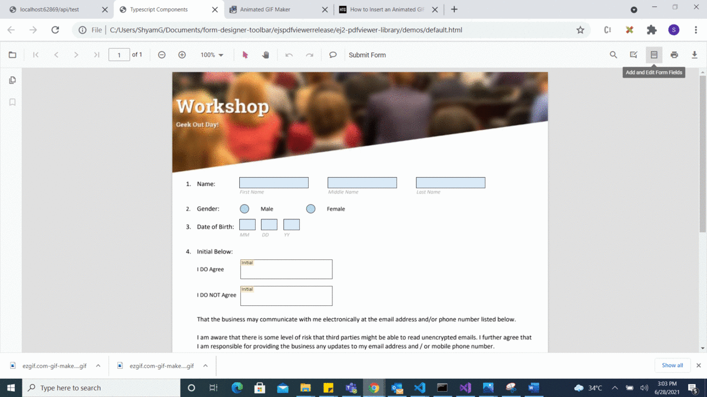
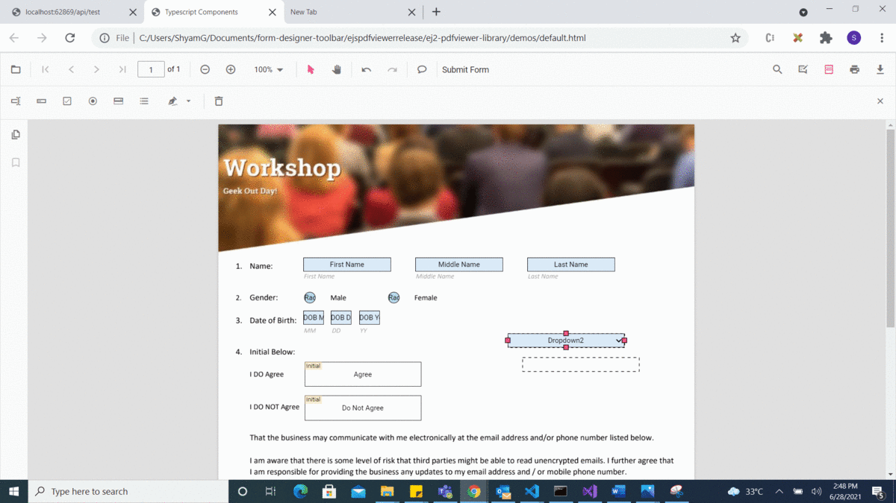
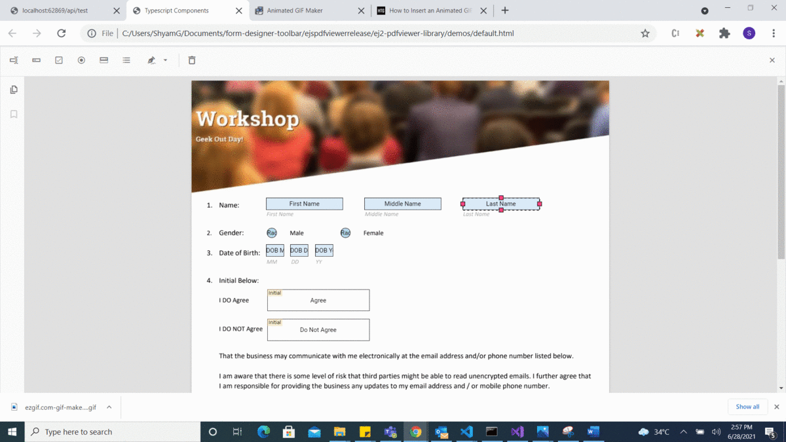
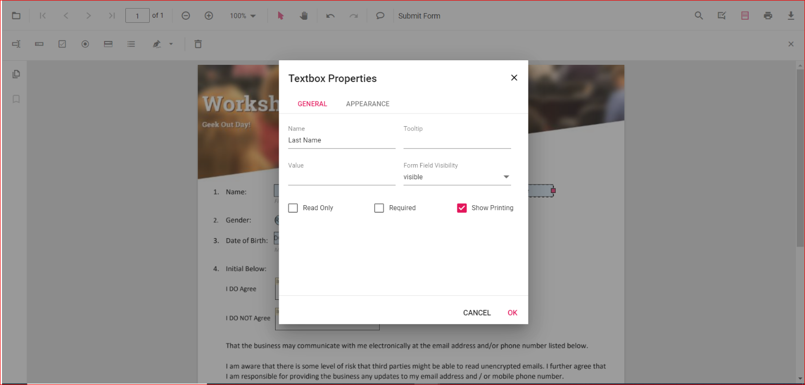
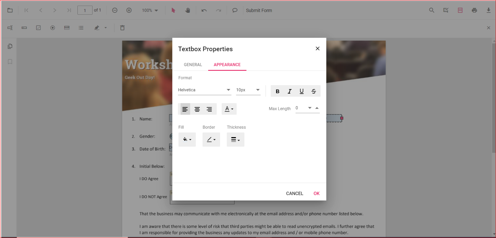
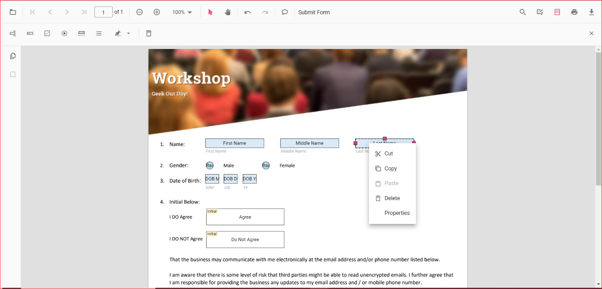

# Create with UI Interaction

The PDF viewer control provides the option for interaction with Form Fields such as Drag and resize. you can draw a Form Field dynamically by clicking the Form Field icon on the toolbar and draw it in the PDF document. The Form Fields type supported by the PDF Viewer Control are:

    * Textbox
    * Password
    * CheckBox
    * RadioButton
    * ListBox
    * DropDown
    * SignatureField
    * InitialField

## Enable or Disable form designer toolbar

We should inject FormDesigner module and set enableFormDesignerToolbar as true to enable the Form designer icon on the toolbar. By default, enableFormDesignerToolbar is set as true. Use the following code to inject FormDesigner module and to enable the enableFormDesignerToolbar property.

```html
import { ViewChild } from '@angular/core';
import { Component, OnInit } from '@angular/core';
import {
  PdfViewerComponent, LinkAnnotationService, BookmarkViewService, MagnificationService, ThumbnailViewService,
  ToolbarService, NavigationService, TextSearchService, TextSelectionService, PrintService, AnnotationService, FormDesignerService, FormFieldsService
} from '@syncfusion/ej2-angular-pdfviewer';

@Component({
  selector: 'app-root',
  // Specifies the template string for the PDF Viewer component.
  template: `<div class="content-wrapper">
  <ejs-pdfviewer id="pdfViewer" [serviceUrl]='service' [documentPath]='document' [enableFormDesignerToolbar]='true' style="height:640px;display:block"></ejs-pdfviewer>
  </div>`,
  providers: [LinkAnnotationService, BookmarkViewService, MagnificationService, ThumbnailViewService, ToolbarService,
NavigationService, TextSearchService, TextSelectionService, PrintService, AnnotationService, FormDesignerService, FormFieldsService]
})
export class AppComponent implements OnInit {
  @ViewChild('pdfviewer')
  public pdfviewerControl: PdfViewerComponent;
  public service: string = 'https://ej2services.syncfusion.com/production/web-services/api/pdfviewer';
  public document: string = 'FormDesigner.pdf';
  ngOnInit(): void {
  }
}
```

## Add the form field dynamically

Click the Form Field icon on the toolbar and then click on to the PDF document to draw a Form Field. Refer the below GIF for further reference.



## Drag the form field

We provide options to drag the Form Field which is currently selected in the PDF document. Refer the below GIF for further reference.



## Resize the form field

We provide options to resize the Form Field which is currently selected in the PDF document. Refer the below GIF for further reference.



## Edit or Update the form field dynamically

The properties of the Form Fields can be edited using the Form Field Properties window. It can be opened by selecting the Properties option in the context menu that appears on the right by clicking the Form Field object. Refer the below image for the properties available to customize the appearance of the Form Field.  






## Clipboard operation with form field

The PDF Viewer control supports the clipboard operations such as cut, copy and paste for Form Fields. You can right click on the Form Field object to view the context menu and select to the clipboard options that you would like to perform. Refer the below image for the options in the context menu.



## Undo and Redo

We provided support to undo/redo the Form Field actions that are performed at runtime. Use the following code example to perform undo/redo actions.

```html
<script>
    window.onload = function () {
        var pdfViewer = document.getElementById('pdfviewer').ej2_instances[0];
        pdfViewer.undo();
        pdfViewer.redo();
    }
</script>

```