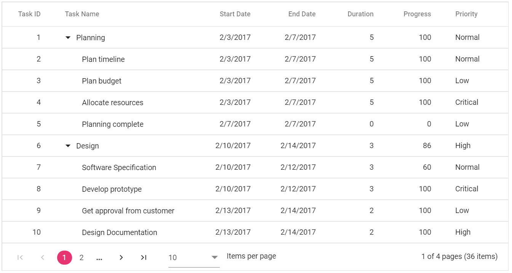

# Paging

Paging provides an option to display TreeGrid data in page segments. To enable paging, set the [`allowPaging`](../api/treegrid/#allowpaging) to true. When paging is enabled, pager component renders at the bottom of the treegrid.
Paging options can be configured through the [`pageSettings`](../api/treegrid/#pagesettings).

To use paging, inject the [`Page`](../api/treegrid/#pagermodule) module in the treegrid.



```typescript
import { Component, OnInit } from '@angular/core';
import { sampleData } from './datasource';

@Component({
    selector: 'app-container',
    template: `<ejs-treegrid [dataSource]='data'  [treeColumnIndex]='1' [allowPaging]='true' [pageSettings]='pageSettings' childMapping='subtasks' >
        <e-columns>
                    <e-column field='taskID' headerText='Task ID' textAlign='Right' width=90></e-column>
                    <e-column field='taskName' headerText='Task Name' textAlign='Left' width=180></e-column>
                    <e-column field='startDate' headerText='Start Date' textAlign='Right' format='yMd' width=90></e-column>
                    <e-column field='duration' headerText='Duration' textAlign='Right' width=80></e-column>
        </e-columns>
                </ejs-treegrid>`
})
export class AppComponent implements OnInit {

    public data: Object[];
    public pageSettings: Object ;

    ngOnInit(): void {
        this.data = sampleData;
        this.pageSettings = {pageSize: 7};
    }
}

```



> You can achieve better performance by using treegrid paging to fetch only a pre-defined number of records from the data source.

## Page Size Mode

Two behaviors are available in TreeGrid paging to display certain number of records in a current page. Following are the two types of [`pageSizeMode`](../api/treegrid/pageSettingsModel/#pagesizemode).

* **All** : This is the default mode. The number of records in a page is based on [`pageSize`](../api/treegrid/pageSettingsModel/#pagesize) property.
* **Root** : The number of root nodes or the 0th level records to be displayed per page is based on [`pageSize`](../api/treegrid/pageSettingsModel/#pagesize) property.

With [`pageSizeMode`](../api/treegrid/pageSettingsModel/#pagesizemode) property as `Root`, only the root level or the 0th level records are considered in records count.



```typescript
import { Component, OnInit } from '@angular/core';
import { sampleData } from './datasource';

@Component({
    selector: 'app-container',
    template: `<ejs-treegrid [dataSource]='data' height='265' [treeColumnIndex]='1' [allowPaging]='true' [pageSettings]='pageSettings' childMapping='subtasks' >
        <e-columns>
                    <e-column field='taskID' headerText='Task ID' textAlign='Right' width=90></e-column>
                    <e-column field='taskName' headerText='Task Name' textAlign='Left' width=180></e-column>
                    <e-column field='startDate' headerText='Start Date' textAlign='Right' format='yMd' width=90></e-column>
                    <e-column field='duration' headerText='Duration' textAlign='Right' width=80></e-column>
        </e-columns>
                </ejs-treegrid>`
})
export class AppComponent implements OnInit {

    public data: Object[];
    public pageSettings: Object ;

    ngOnInit(): void {
        this.data = sampleData;
        this.pageSettings = {pageSize: 2, pageSizeMode: 'Root'};
    }
}

```



## Template

You can use custom elements inside the pager instead of default elements.
The custom elements can be defined by using the [`template`](../api/treegrid/pageSettingsModel/#template) property.
Inside this template, you can access the [`currentPage`](../api/treegrid/pageSettingsModel/#currentpage), [`pageSize`](../api/treegrid/pageSettingsModel/#pagesize), [`pageCount`](../api/treegrid/pageSettingsModel/#pagecount), `totalPage` and `totalRecordCount` values.



```typescript
import { Component, OnInit,ViewChild } from '@angular/core';
import { sampleData } from './datasource';
import {TreeGridComponent} from '@syncfusion/ej2-angular-treegrid';
import { ChangeEventArgs } from '@syncfusion/ej2-inputs';

@Component({
    selector: 'app-container',
    template: `<ejs-treegrid #treegrid [dataSource]='data' height=250 [treeColumnIndex]='1' [allowPaging]='true' childMapping='subtasks' >
       <ng-template #pagerTemplate let-data>
    <div class="e-pagertemplate">
        <div class="col-lg-12 control-section">
            <div class="content-wrapper"  style="margin-top:5px;margin-left:30px;border: none; display: inline-block ">
              <ejs-numerictextbox format='###.##' step='1' width='75' min='1' max='3' value={{data.currentPage}}
              (change)='change($event)'></ejs-numerictextbox>
            </div>
        </div>
        <div id="totalPages" class="e-pagertemplatemessage"
         style="margin-top:5px;margin-left:30px;border: none; display: inline-block ">
         <span class="e-pagenomsg">{{data.currentPage}} of {{data.totalPages}} pages
         ({{data.totalRecordsCount}} items)</span>
      </div>
    </div>
    </ng-template>
        <e-columns>
                    <e-column field='taskID' headerText='Task ID' textAlign='Right' width=90></e-column>
                    <e-column field='taskName' headerText='Task Name' textAlign='Left' width=180></e-column>
                    <e-column field='startDate' headerText='Start Date' textAlign='Right' format='yMd' width=90></e-column>
                    <e-column field='duration' headerText='Duration' textAlign='Right' width=80></e-column>
        </e-columns>
                </ejs-treegrid>`
})
export class AppComponent implements OnInit {

    public data: Object[];
    @ViewChild('treegrid')
    public treeGridObj: TreeGridComponent;
    ngOnInit(): void {
        this.data = sampleData;
    }
       change(args:ChangeEventArgs){
            this.treeGridObj.goToPage(args.value);
            }
}

```



## Pager with Page Size Dropdown

The pager Dropdown allows you to change the number of records in the TreeGrid dynamically. It can be enabled by defining the [`pageSettings.pageSizes`](../api/treegrid/pageSettingsModel/#pagesizes) property as true.

```typescript
pageSettings: {pageSize: 7, pageSizes: true},
```



## How to render Pager at the Top of the TreeGrid

By default, Pager will be rendered at the bottom of the TreeGrid. You can also render the Pager at the top of the TreeGrid by using the `dataBound` event.



```typescript
import { Component, OnInit,ViewChild } from '@angular/core';
import { sampleData } from './datasource';
import {TreeGridComponent} from '@syncfusion/ej2-angular-treegrid';
@Component({
    selector: 'app-container',
    template: `<ejs-treegrid #treegrid [dataSource]='data' (dataBound)='dataBound()' [treeColumnIndex]='1' [allowPaging]='true' [pageSettings]='pageSettings' childMapping='subtasks' >
        <e-columns>
                    <e-column field='taskID' headerText='Task ID' textAlign='Right' width=90></e-column>
                    <e-column field='taskName' headerText='Task Name' textAlign='Left' width=180></e-column>
                    <e-column field='startDate' headerText='Start Date' textAlign='Right' format='yMd' width=90></e-column>
                    <e-column field='duration' headerText='Duration' textAlign='Right' width=80></e-column>
        </e-columns>
                </ejs-treegrid>`
})
export class AppComponent implements OnInit {

    public data: Object[];
    public pageSettings: Object ;
    public initialGridLoad: boolean;
    @ViewChild('treegrid')
    public treeGridObj: TreeGridComponent;
    ngOnInit(): void {
        this.data = sampleData;
        this.pageSettings = {pageSize: 7, pageSizes: true};
        this.initialGridLoad = true;
    }
    dataBound(){
    if (this.initialGridLoad) {
        this.initialGridLoad = false;
        var pager = document.getElementsByClassName('e-gridpager');
        var topElement;
        if ( this.treeGridObj.toolbar) {
            topElement = document.getElementsByClassName('e-toolbar');
        } else {
            topElement = document.getElementsByClassName('e-gridheader');
        }
        topElement[0].before(pager[0]);
    }
}
}

```



> During the paging action, the pager component triggers the below three events.
> * The `created` event triggers when Pager is created.
> * The `click` event triggers when the numeric items in the pager is clicked.
> * The `dropDownChanged` event triggers when pageSize DropDownList value is selected.